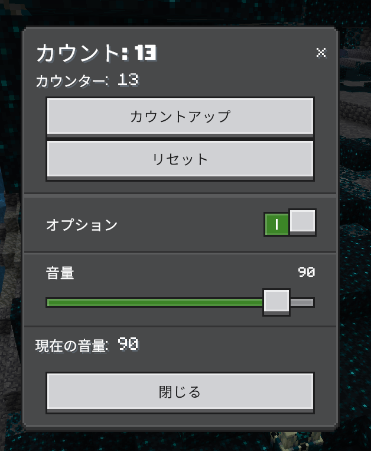
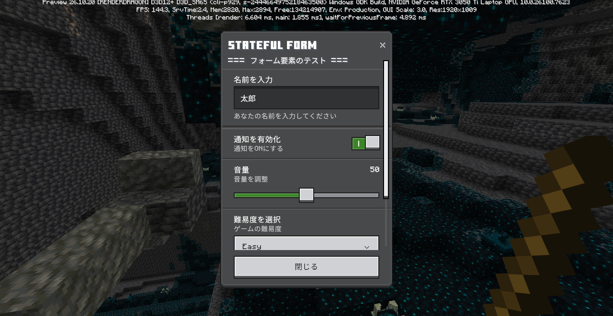

# DDUI_sample

DataDrivenUI (DDUI) のサンプル

このリポジトリは、マインクラフト統合版（Windowsプレビュー版）で利用できる **DDUI / OreUI** を使ったUIサンプルをまとめています。
DDUIは統合版内部データとして存在するOreUIを**Script APIから扱いやすくしたラッパー**です。

---

## 前提条件

* マインクラフト統合版 **プレビュー版 (Windows)**
* Script API の基本知識 (JavaScriptでワールド内イベント操作)
* 実験的な利用であることの理解

---

## セットアップ

1. 以下のパスにある任意のバージョンのJSファイルを開く:

```
C:\XboxGames\Minecraft Preview for Windows\Content\data\behavior_packs\server_ui_library
```

2. 末尾に次を追加して、DDUIをScript APIで使えるようにする:

```js
import * as ui from "@minecraft/server-ui-private-bindings";

export const ddui = ui.ddui;
export const DataStore = ui.DataStore;
export const DataDrivenScreen = ui.DataDrivenScreen;
export const testConstant = ui.testConstant;
```

3. `custom_form_builder.js` をプロジェクトにコピーして利用します。

---

## ラッパー（custom_form_builder.js）の利用

* DDUIには型定義がないため、ラッパーを使うと補完が効き安全に扱える
* フォーム作成の手順を簡略化し、ActionForm/ModalFormの組み合わせも容易

```js
import { CustomFormBuilder } from "./custom_form_builder.js";

const form = new CustomFormBuilder(player);
form
  .addHeader("Example UI")
  .addButton("OK", () => console.log("OK pressed"))
  .addButton("Cancel", () => console.log("Cancel pressed"))
  .show();
```

---

## サンプルコード

* 実際に動作するサンプルはこちらで確認できます:
  [DDUI_sample / sample.js](https://github.com/karonyt/DDUI_sample/blob/main/sample.js)

* 棒を右クリックでUIを表示

* ボタン押下などのイベント処理

* 複数要素や動的変更の例

---

## サンプルスクリーンショット

実際にサンプルを動かすと、例えばこんなUIが表示されます：



応用すればこんなものも作れます



---

## 使い方のポイント

* JSON UIはまだ使えるが将来的には廃止予定
* DDUIを使うことで動的で柔軟なUI設計が可能
* ラッパーを使うと補完が効く
* 実験的利用であり、本番環境での使用は推奨されません

---

## ライセンス

MIT ライセンスで公開しています。自由に利用・改変可能です。
